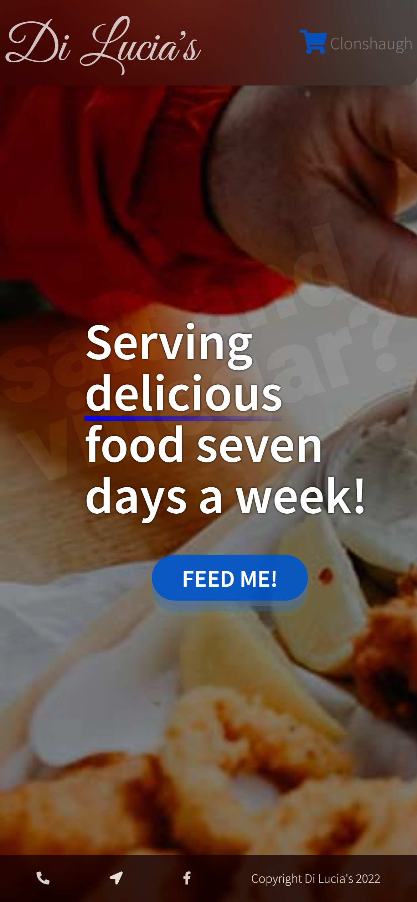
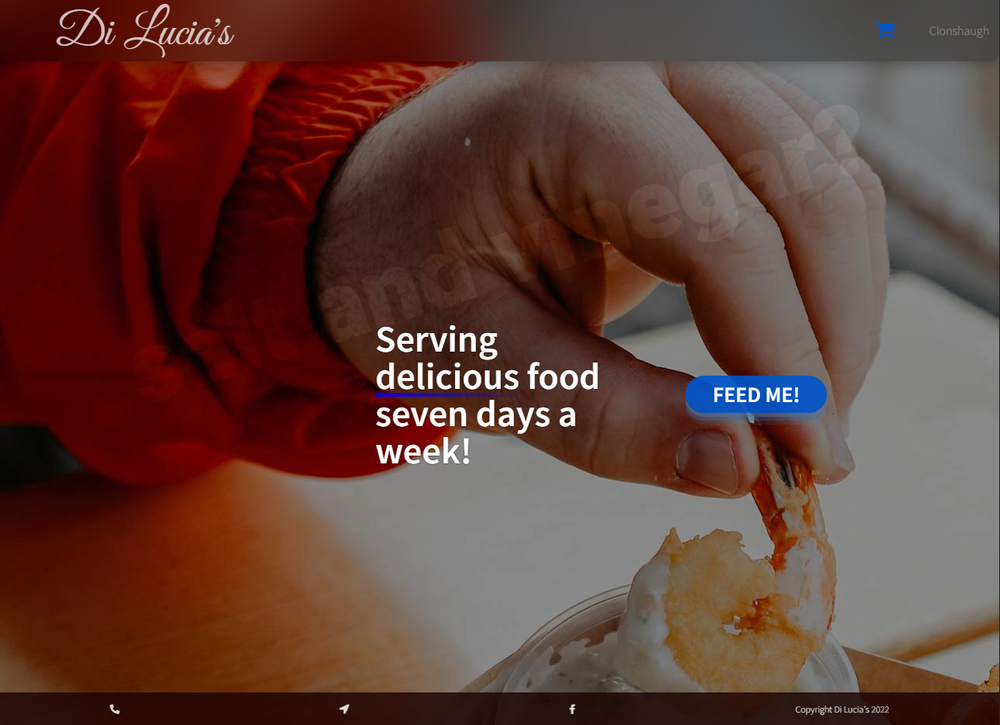
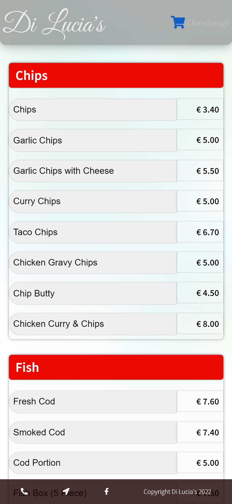
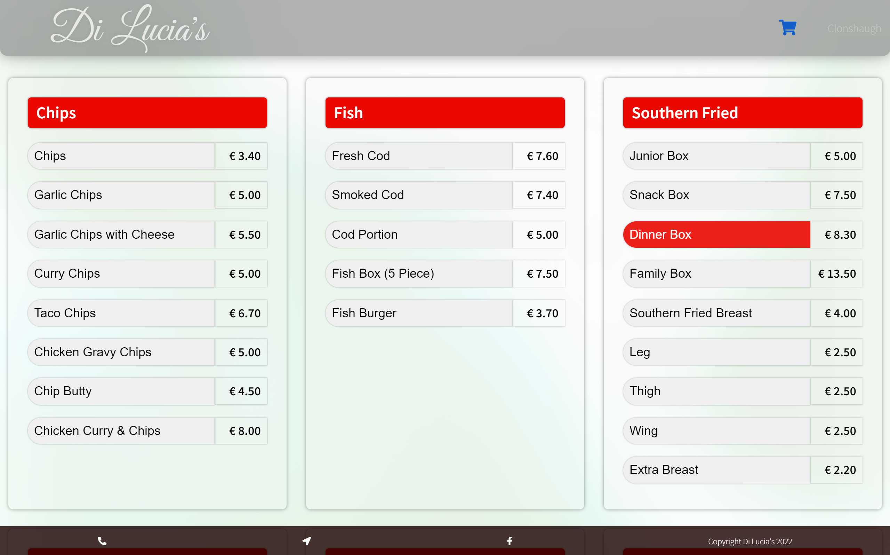
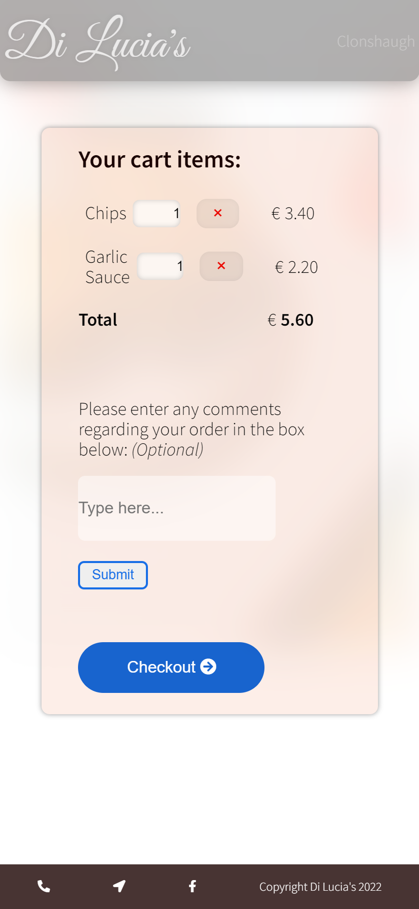
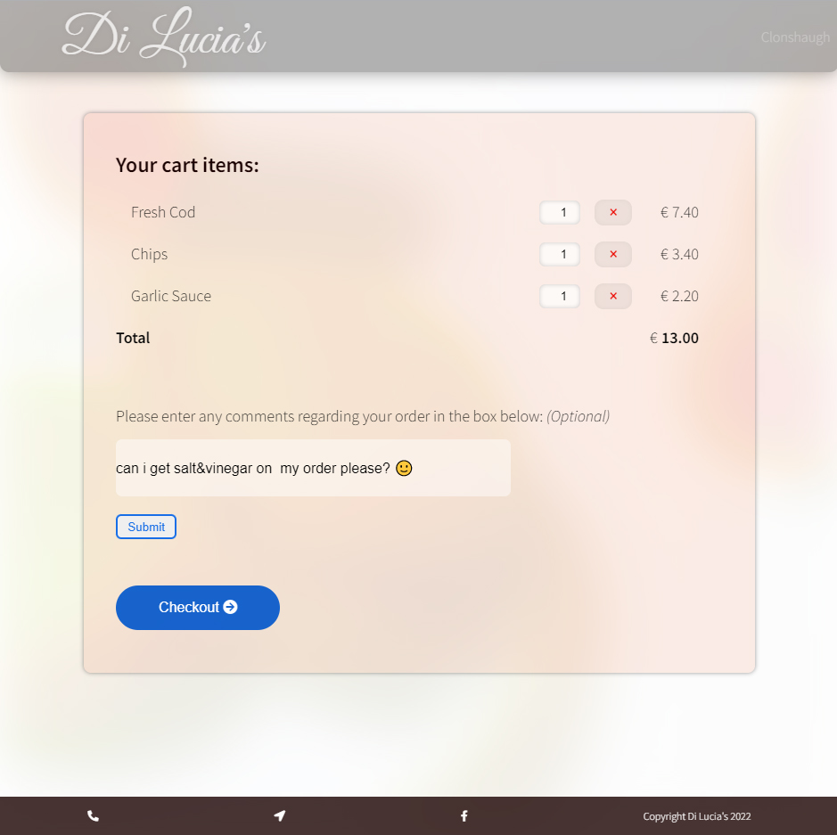

# Di Lucias

Di Lucia's Clonshaugh is a site designed for the people of Clonshaugh to order food from their local chip shop. The site's easy to use interface will assure for a joyful expierience of getting a hearty meal.

## Features

- ## Landing page

As we can see from the images above, we land on the home page, which is designed very minimalistically, having an image and a high contrast call to action button which demands your attention.

On the top portion we get a navbar which displays the title and cart icon, and the footer which has some basic information and links, like location, phone number, address and Facebook page.

- ## Menu

Once the call to action is clicked, we get the menu section, displaying all the different items in their respective groups.

The layout is extremely easy and user-friendly. Each button for the items shows its name and price beside it.

>"Now I like this, this is what most websites look nowadays and it looks very easy."
Shauna

>"For an old man like me, this is perfect, i don't have to do anything mad to order."
Morris

___

- ## Shopping Cart

The shopping cart itself is very basic structured, where all the items added to it appear in a list type with all the respective information of each one: the item name, quantity and price, as well as a delete button for each one.
The total of all the items is located right underneath it, in bold text.

Just before a customer makes the purchase, they get asked if they have any notes about their order, such as extra options, no options or allergen information in a text input form.

And finally a pill shaped checkout button, which animates based on hover or focus states.
___

### Features to be added in the future
- Allergen information for each item
- Delivery service section
- Data protection regulation policy

___

## Responsive layout

This webpage is fully responsive starting from small screen sizes from 320px up to 4k monitors.
On the landing page, the <code>\<picture></picture></code> element is utilized in a way so it loads different image sizes depending on the screen size.

The call to action section utilizes <code>display: grid;</code> to show the tagline and CTA button into columns on larger screens, and collapse them into rows on mobile screens.

Menu items are <code>flex-items</code>, which minimize into a single column on mobile devices, but will take as much space available on larger screens.

## Validator

* HTML
  - No errors were found in W3C validator

* CSS
  - One error found (<code>grid-template-rows</code>, not fixed)

* JS
  - No errors found

## Unfixed Bugs

The function for adding items to the cart isn't functional. Due to the menu and cart being on two different pages, I had some issues with storing values about every button that was clicked on. I experimented with setting items to <code>localStorage</code> but I couldn't find a solution as of yet. Looking forward to solve that problem.

## Deployment

## Credits

Most information was taken from the Javascript module, WebDevSimplified on YouTube and Slack(My mentor).

## Content

* Font Awesome for the awesome icons
* Menu leaflet from the chipper I work in

## Media

- All pictures used in this project were taken by <a href="unsplash.com" target="_blank">unsplash.com</a>

## Other notes

There was an issue with <code>git push</code> after deployment, which wasn't in sync with the rest of the other files. There were also a few minor changes in the CSS and JS files in the last pre-deploy commit which weren't saved.